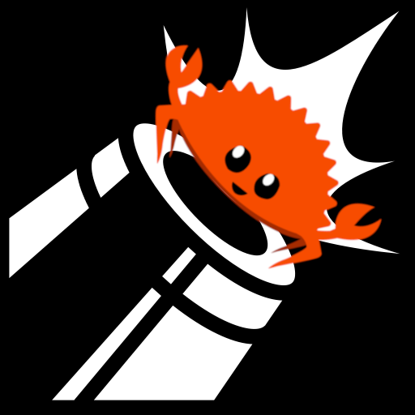

# Cannon-rs 

[![Contributors][contributors-shield]][contributors-url]
[![Forks][forks-shield]][forks-url]
[![Stargazers][stars-shield]][stars-url]
[![Issues][issues-shield]][issues-url]
[![LGPL-3 License][license-shield]][license-url]

A comprehensive collection of crates and tools to support development of Cannon programs in Rust

<!-- ABOUT THE PROJECT -->
## About The Project

Cannon-rs aims to support the emerging number of projects using Rust to develop provable programs for Optimism Cannon. This is the evolution of the rust-cannon-template supported by the Optimism RetroPGF round 2.

Advantages of using Rust are:

- **Code Reuse** - Take advantage of existing, trusted crates in the crypto ecosystem
- **Compact Binaries** - Cannon programs built using Rust are much smaller than their Golang equivalents
- **Proving Speed** - Generating proofs through emulation for large programs can be slow. Effective use of Rust can reduce the length of the program trace required speeding up the proving process

The project itself provides a number of tools to enable this:

#### Build system using Docker

Although MIPS is a standard Rust target the specific configuration needed to support the Cannon ISA is quite different. Cannon-rs provides a [custom Rust target](./mips-unknown-none.json) and a [Docker image](./Dockerfile.cannon-builder) configured to build elf files which can be patched to run within Cannon.

#### Guest<->Host Communication

Cannon uses syscalls for communication between the guest program and the host. The [cannon-io](./cannon-io/README.md) crate exposes a simple and safe wrapper around the low level syscalls to allow printing to stdout, retrieving data via the pre-image oracle and safely terminating a program with an exit code.

#### Preimage Server

The [Optimism Cannon emulator](https://github.com/ethereum-optimism/optimism/tree/develop/cannon) uses custom IO streams to communicate with a child process responsible for retrieving preimage data given its key. The Cannon preimage server implementation is geared toward providing access to the Ethereum data required for rollup execution.  

Cannon-rs provides a simple CLI tool for serving preimages stored in a JSON file. This can be extended with new implementations of the `PreimageProvider` trait in order to provide a tool suited to your application.

<!-- GETTING STARTED -->
## Getting Started

Install the `cargo cannon` tool by running

```shell
cargo install --git https://github.com/badboilabs/Cannon-rs cargo-cannon
```

### Prerequisites

Cross compiling for Cannon requires:
- Docker

<!-- USAGE EXAMPLES -->
## Usage

TODO

## Roadmap

- [x] Rust build system for Cannon MIPS target (no_std)
- [x] Heap implementation
- [x] Guest<->Host Communication
    - [x] stdout
    - [x] Request data via Preimage Oracle
    - [x] Hints
- [x] Template for bootstrapping own projects
- [x] Preimage Server
    - [x] Server compatible with [Optimism Cannon emulator](https://github.com/ethereum-optimism/optimism/tree/develop/cannon)
    - [x] Serve preimages from JSON file
- [ ] cargo cannon tooling
    - [ ] `cargo cannon build` to wrap docker cross-compilation
    - [ ] `cargo cannon new` to create new Cannon projects

See the [open issues](https://github.com/BadBoiLabs/Cannon-rs/issues) for a full list of proposed features (and known issues).

<!-- CONTRIBUTING -->
## Contributing

Contributions are very welcome! To contribute please

1. Fork the Project
2. Create your Feature Branch (`git checkout -b feature/AmazingFeature`)
3. Commit your Changes (`git commit -m 'Add some AmazingFeature'`)
4. Push to the Branch (`git push origin feature/AmazingFeature`)
5. Open a Pull Request

A huge thanks to all existing contributors from the community!!

<a href="https://github.com/BadBoiLabs/Cannon-rs/graphs/contributors">
  
</a>

<!-- Used By -->

## Used By

<p align="middle" float="left">
  <a href="https://chainsafe.io/">
    
  </a>
  <text>
  <a href="https://buildwithsygma.com">
   
  </a>
</p>

<!-- LICENSE -->
## License

Distributed under the LGPL-3 License. See [LICENSE](./LICENSE) for more information.


<!-- CONTACT -->
## Contact

Willem Olding - [@willemolding1](https://twitter.com/willemolding1) - willemolding@gmail.com

Project Link: [https://github.com/BadBoiLabs/Cannon-rs](https://github.com/BadBoiLabs/Cannon-rs)

<!-- MARKDOWN LINKS & IMAGES -->
<!-- https://www.markdownguide.org/basic-syntax/#reference-style-links -->
[contributors-shield]: https://img.shields.io/github/contributors/BadBoiLabs/Cannon-rs.svg?style=for-the-badge
[contributors-url]: https://github.com/BadBoiLabs/Cannon-rs/graphs/contributors
[forks-shield]: https://img.shields.io/github/forks/BadBoiLabs/Cannon-rs.svg?style=for-the-badge
[forks-url]: https://github.com/BadBoiLabs/Cannon-rs/network/members
[stars-shield]: https://img.shields.io/github/stars/BadBoiLabs/Cannon-rs.svg?style=for-the-badge
[stars-url]: https://github.com/BadBoiLabs/Cannon-rs/stargazers
[issues-shield]: https://img.shields.io/github/issues/BadBoiLabs/Cannon-rs.svg?style=for-the-badge
[issues-url]: https://github.com/BadBoiLabs/Cannon-rs/issues
[license-shield]: https://img.shields.io/github/license/BadBoiLabs/Cannon-rs.svg?style=for-the-badge
[license-url]: https://github.com/BadBoiLabs/Cannon-rs/blob/master/LICENSE.txt
